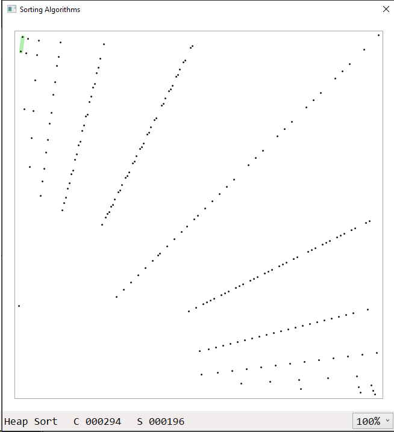

# Sorting Algorithm Visualizer

F# Windows application to watch different sorting algorithms do their job.
Currently, the following algorithms are implemented:

* [Bubble Sort](./src/Algorithms/Bubble%20Sort.fs)
* [Cocktail Shaker Sort](./src/Algorithms/Cocktail%20Shaker%20Sort.fs)
* [Comb Sort](./src/Algorithms/Comb%20Sort.fs)
* [Cycle Sort](./src/Algorithms/Cycle%20Sort.fs)
* [Gnome Sort](./src/Algorithms/Gnome%20Sort.fs)
* [Heap Sort](./src/Algorithms/Heap%20Sort.fs)
* [Insertion Sort](./src/Algorithms/Insertion%20Sort.fs)
* [Merge Sort (In Place)](./src/Algorithms/Merge%20Sort%20In%20Place.fs)
* [Merge Sort (Top Down)](./src/Algorithms/Merge%20Sort%20Top%20Down.fs)
* [Quick Sort (Hoare, Median of Three)](./src/Algorithms/Quick%20Sort.fs)
* [Selection Sort](./src/Algorithms/Selection%20Sort.fs)
* [Shear Sort](./src/Algorithms/Shear%20Sort.fs)
* [Shell Sort](./src/Algorithms/Shell%20Sort.fs)
* [Smooth Sort](./src/Algorithms/Smooth%20Sort.fs)

The algorithms are based on an async state computation expression to hide as much
of the plumbing for the visualization so that the algorithms look as readable as
possible.

You need Visual Studio 2019 on Windows to launch the application, since it relies
on the FsXaml type provider, which is only available for legacy .NET. Once the
application has been launched, you can select different options from the context
menu of the canvas.

The available configuration options are:

* **Start / Stop:** Launch the sorting process with the given configuration, or
  stop it when it is active.
* **Pause:** Pauses the sorting process. This can also be achieved with the space bar.
* **Algorithm:** Select the sorting algorithm you wish to see in here.
* **Item Count:** Choose the number of items to sort, some O(N²) algorithms might
  can take a long time to finish with lots of items to sort.
* **Item Layout:** Determines how the items are laid out across the canvas when a sorting
  process is started. Different settings can trigger worst-case scenarios for some
  algorithms or paint a beatiful picture in some cases. Check the screenshots at the bottom.
  * **Randomized:** An ascending list of items is scattered across the board. No item will
    occur twice and once sorting is complete, a straight line will result.
  * **Ascending:** All items start already sorted. This sounds boring, because it is the
    best case for many algorithms, but try Heap Sort with it (or check the screenshots).
  * **Descending:** All items start in descending order. This is the worst-case of some
    of the simpler algorithms, and they tend to take a long time with this setting.
  * **Alternating:** An alternating sequence of small and large items.
  * **Arbitrary:** A completely random set of items, so some items may appear multiple
    times or not at all.
  * **Crossed:** Items are ordered to appear like a cross on the canvas.
* **Delay:** The time delay between comparison and swap operations on screen.

## Interesting Screenshots

### Cocktail Shaker Sort

**Cocktail Shaker Sort, 200 items, randomized layout**

Cocktail Shaker Sort is a Bubble Sort variant that works from both ends, so to speak.
The screenshot shows sorted lower and sorted upper sections that have been "bubbled down"
and "bubbled up", respectively. The section in the middle are the items yet to be sorted.

### Heap Sort

**Heap Sort, 200 items, ascending layout**

Heap Sort works by internally ordering the items to sort in a binary tree that is encoded
inside the items themselves. This binary tree structure is what gives Heap Sort its name
and it has to be built during the sorting process. This screenshot is right after the heap
structure has been created and the sorting process is about to begin.

### Merge Sort

**Merge Sort (In Place), 200 items, randomized layout**

This shows the in-place Merge Sort algorithm half way between merging two sorted sub-sequences.
The in-place variant of Merge Sort does not have the luxury of a secondary working array, so
it has to make do with just the items it got. It creates sorted sequences inside the items
and merges them to create a larger sorted sequence. It continues this process until the whole
item sequence has been sorted.

### Quick Sort

**Quick Sort, 200 items, randomized layout**

Quick Sort works by picking an item called the "pivot", and places all items small thran it
on the left and all items larger than it on the right, thereby dividing the items into two
smaller sections that can be sorted separately. Here you can see the state of the items
after the first partitioning.

### Shear Sort

**Shear Sort, 200 items, descending layout**

Shear Sort is really a two-dimensional sorting algorithm used to sort matrices of numbers.
But any array of number can be treated as a matrix with side-length `sqrt(count)`,
right? So in this way Shear Sort can even be used to sort a regular array. What's shown
in the screenshot is Shear Sort half way between performing the shear operation after sorting
the rows in its fake matrix.

### Smooth Sort

**Smooth Sort, 200 items, descending layout**

Smooth Sort is a much crazier version of Heap Sort. The problem with Heap Sort is, that it
*always* has to build its heap structure even when the items are already sorted to begin with.
Smooth Sort builds a different internal structured based on
[Leonardo Numbers](https://en.wikipedia.org/wiki/Leonardo_number). This screenshot is right after
this structure has been created and the sorting process is about to begin. You can see different
size "Leonardo trees".